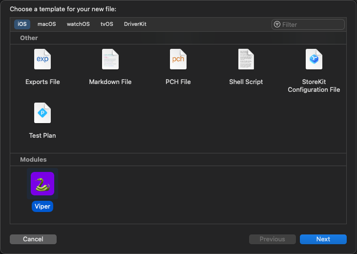
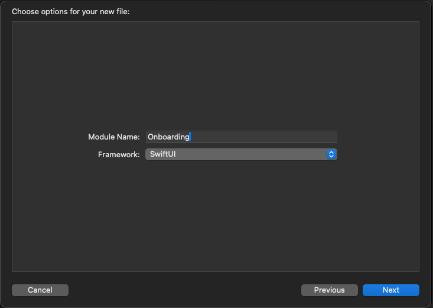
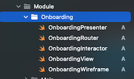

<p align="center">
  
</p>

Xcode custom template for easily creating a Viper architecture module.</br>
You'll get useful boilerplate out of the box, with the module name placed in the relevant classes' and protocols' names.</br>
The module has two types, based on the UI framework your'e using. Select the one that fits your project.</br></br>
See [SwiftUI Viper Template](https://github.com/TelemTobi/SwiftUI-Viper-Template.git) or [UIKit Viper Template](https://github.com/TelemTobi/UIKit-Viper-Template.git) for the complete architecture template.

<br/>

<p align="center">
  
  
  
</p>

<br/>

## Features

- [x] **View / ViewController** - The responsibility of the view is to send the user actions to the presenter and shows whatever the presenter tells it.
- [x] **Presenter** - Its responsibility is to get the data from the interactor on user actions and after getting data from the interactor, it sends it to the view to show it. It also asks the router for navigation.
- [x] **Router** - It has all navigation logic for describing which screens are to be shown when.
- [x] **Interactor** - This is the backbone of an application as it contains the business logic. It has access to the world outside of the module.
- [x] **Wireframe** - A factory for creating the view with all its dependencies.

<br/>

## Installation

### Terminal

The module templates can simply be installed via terminal. run the following command:

```
curl "https://raw.githubusercontent.com/TelemTobi/Viper-Module-Template/main/install_template.sh" | bash
```

### Manual

In order to install the templates manually, You'll have to first download the repository.</br>
Now either run the `install.template.sh` file in your terminal:

```
sh <PATH_TO_SHELL_FILE>
```

or move the `Viper.xctemplate` to:

```
/Applications/Xcode.app/Contents/Developer/Library/Xcode/Templates/File Templates/Modules
```
<br/>

And your'e all set! 🐍
